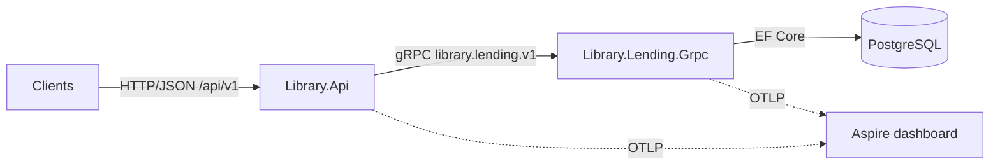

# Library Lending API

This is my solution for the Library API assignment. A public library wants answers about its inventory and
its readers: which books go out most, who borrows the most, how fast people read, and what else the readers
of a given book pick up. The system answers those questions and also manages the lending itself.

It is built as two applications. A public HTTP API that clients call, and behind it a Lending gRPC service
that owns the business rules and the PostgreSQL database. The assignment asks for an API layer and a service
layer talking over gRPC, and to design it the way a real service with real clients would be designed. That
is the shape below.



## Quick start

You need Docker (Desktop, or Engine with Compose v2). The .NET 10 SDK is only needed to run the code or the
tests outside containers.

```bash
docker compose up --build
```

| What | Where |
|---|---|
| Interactive API docs (Scalar) | http://localhost:8080/scalar |
| OpenAPI document | http://localhost:8080/openapi/v1.json |
| API health, which also probes the gRPC service | http://localhost:8080/health |
| Lending gRPC service (HTTP/2 without TLS) | `localhost:5001` |
| Lending service HTTP health | http://localhost:5002/health |
| Traces, metrics and logs of both services (Aspire dashboard) | http://localhost:18888 |
| PostgreSQL | `localhost:5433`, database, user and password are all `library` |

PostgreSQL is published on 5433 on purpose, so a local PostgreSQL on 5432 does not get in the way. All host
ports can be changed with `API_PORT`, `LENDING_GRPC_PORT`, `LENDING_HTTP_PORT`, `POSTGRES_PORT` and
`DASHBOARD_PORT`, for example in a `.env` file next to `docker-compose.yml`.

On the first start the service creates the schema and seeds 40 books, 25 borrowers and about 340 loans over
the last 18 months. The history is generated through the same domain rules the API enforces, so it never
contradicts them, and every analytics endpoint has data from the first second:

```bash
curl -s "http://localhost:8080/api/v1/analytics/books/most-borrowed?top=5" | jq
```

```bash
curl -s "http://localhost:8080/api/v1/analytics/borrowers/top?from=2026-01-01T00:00:00Z&to=2027-01-01T00:00:00Z&top=5" | jq
```

Then open the dashboard and look at the trace of that request. One trace, two processes, three levels:
the HTTP request, the gRPC call and the SQL statements. Nothing in the code propagates the trace by hand.

### Running the tests

```bash
dotnet test
```

Docker has to be running. The integration and functional tests start a real PostgreSQL 18 container through
Testcontainers, one container per test assembly and a fresh, migrated database per test class. Nothing is
mocked at those levels. Coverage: `dotnet test --collect:"XPlat Code Coverage"`.

### Running without Compose

```bash
docker compose up postgres -d                  # or your own PostgreSQL, see ConnectionStrings:Lending
dotnet run --project Library.Lending.Grpc      # gRPC on 5001, HTTP health on 5002, migrates and seeds
dotnet run --project Library.Api               # HTTP on 8080
dotnet run --project Library.Warmup            # the four warmup exercises
```

The default connection string in `appsettings.json` points at the Compose database. If you want a different
one, put it in user secrets instead of editing the file:

```bash
dotnet user-secrets set "ConnectionStrings:Lending" "Host=localhost;Port=5432;Database=mydb;Username=me;Password=secret" --project Library.Lending.Grpc
```

Telemetry export is optional. `Otel:Endpoint` points at `http://localhost:18889` by default, which is the
dashboard from Compose (`docker compose up aspire-dashboard -d`). When nothing listens there, the export
fails quietly and the console logs are not affected.

## The four business questions

All rankings are computed by PostgreSQL and only the top rows are materialized. Time ranges are half open,
`[from, to)`, in UTC. Leaving both bounds out means all time. The reviewer left these details to me, so
they are my decisions, and I picked what I think a real library would ask for.

| Question | Endpoint | Decision |
|---|---|---|
| Most borrowed books | `GET /api/v1/analytics/books/most-borrowed?from&to&top` | Ranked by number of loans, ties broken by title. Also reports how many distinct borrowers took each book. |
| Most active borrowers in a period | `GET /api/v1/analytics/borrowers/top?from&to&top` | Ranked by loans opened in the range, ties by name. Same parameters as above, on purpose. |
| Reading pace | `GET /api/v1/analytics/borrowers/{id}/reading-pace` | Only returned loans count, an open loan says nothing about pace yet. Days on loan are at least one, so a same day return does not give an absurd number. The overall pace is total pages over total days, a weighted average, so one quick novella cannot hide a slow epic. A borrower with no returned loans gets `pagesPerDay: null`, not an error. |
| Also borrowed | `GET /api/v1/analytics/books/{id}/also-borrowed?top` | Other books borrowed by the people who borrowed this one, ranked by how many of those people borrowed each (the co borrower count), then by total loans. The book itself is excluded. |

`top` defaults to 10 and is capped at 100. Pages default to 20 rows and are capped at 100.

## Managing the catalogue

| Books | Borrowers | Loans |
|---|---|---|
| `POST /api/v1/books` | `POST /api/v1/borrowers` | `POST /api/v1/loans` with `{bookId, borrowerId}` |
| `GET /api/v1/books?search&page&pageSize` | `GET /api/v1/borrowers?page&pageSize` | `POST /api/v1/loans/{id}/return` |
| `GET /api/v1/books/{id}` | `GET /api/v1/borrowers/{id}` | `GET /api/v1/loans?bookId&borrowerId&status&page&pageSize` |
| `PUT /api/v1/books/{id}` | `PUT /api/v1/borrowers/{id}` | `GET /api/v1/loans/{id}` |
| `DELETE /api/v1/books/{id}` | `DELETE /api/v1/borrowers/{id}` | |

`PUT` replaces all details. A book's inventory may grow or shrink, but never below the copies that are
currently on loan (that is a `422`). `DELETE` only works for a book that was never lent or a member who never
borrowed, otherwise it is a `409`. The lending history refers to them and the reports are computed from it,
so history keeps them alive. The `RESTRICT` foreign keys in the database would insist on the same thing.

### Lending rules

* A book has `totalCopies`. Lending takes one off the shelf, returning puts it back. No copy, no loan (`422`).
* A loan is due 14 days after checkout and is `Overdue` after that until returned (`Lending:LoanPeriodDays`).
* A borrower may hold at most 5 open loans (`Lending:MaxOpenLoansPerBorrower`) and never the same title twice.
* Returning a loan twice is a conflict (`409`).
* Two requests racing for the last copy cannot both win. PostgreSQL's `xmin` is the optimistic concurrency
  token, and check constraints keep `available_copies` between 0 and `total_copies` even if the code had a bug.

## Architecture

Two deployables and a strict dependency direction:

| Project | Role |
|---|---|
| `Library.Api` | Public HTTP/JSON API. Knows only the gRPC contract, never the implementation. Maps gRPC statuses to RFC 9457 problem details, serves OpenAPI and Scalar, rate limits clients, reports health. |
| `Library.Lending.Contracts` | The versioned gRPC contract, package `library.lending.v1`, four services. Generates the client stubs the API uses and the server base classes the service implements. In a real company this is the client package other teams reference. |
| `Library.Lending.Grpc` | gRPC host of the service: request and response mapping, the gRPC rich error model, health protocol, server reflection, OpenTelemetry, migration and seeding at startup. |
| `Library.Lending.Application` | Use cases as small command and query handlers, FluentValidation validators, and the ports the infrastructure implements. No framework, no database. |
| `Library.Lending.Domain` | `Book`, `Borrower`, `Loan`, `Isbn`, `ReadingPace`, `LoanPolicy` and the `LendingDesk` rules. Depends on nothing but the BCL. Business failures are `Result` values, exceptions are for bugs. |
| `Library.Lending.Infrastructure` | EF Core 10 with Npgsql: `DbContext`, migrations, repositories, the analytics LINQ that turns into SQL aggregations, and the sample data seeder. |
| `Library.Warmup` | The four warmup exercises as a console demo. |

Dependencies point inward: `Library.Api --> Library.Lending.Contracts`, and on the service side
`Library.Lending.Grpc --> Application --> Domain`, with `Infrastructure --> Application` implementing the
ports. Nothing in the API can reach application, domain or infrastructure code.

### Decisions and tradeoffs

Two processes, not a modular monolith and not microservices. gRPC sits exactly at the seam the assignment
names, API to service. One service behind the API is honest about the size of the problem. Splitting it
further would add service discovery and distributed debugging for a library that is one bounded context,
and splitting the service internally into RPC calls would be ceremony. The cost is that every feature touches
two hosts and a contract. The gain is that the API can be scaled, versioned and secured on its own, and any
other client can consume the contract directly.

The contract is the only shared artifact. The Contracts project generates both sides from the same `.proto`
files, so there is one source of truth, and the API has no reference to the implementation projects.

Aggregates reference each other by id, never by object. `Loan` carries `BookId` and `BorrowerId` without
navigation properties. Foreign keys still protect the data, but a loan never drags a book and a borrower into
its transaction. Rules that span aggregates live in the `LendingDesk` domain service, a pure function over
already loaded state, which is why those rules have plain unit tests without a single mock. Queries that need
titles or names use explicit joins, and the analytics queries do that anyway.

Ids are UUIDv7, generated in the domain. An aggregate is complete, id included, before it is saved. Public
identifiers cannot be enumerated, which matters for an API without authentication. The time ordered prefix
keeps inserts at the end of the index, unlike random GUIDs. The price is 16 byte keys and URLs no human can
read. The human facing identifiers of a library are the ISBN and, in a fuller system, a membership number.

Errors are data, not exceptions. Handlers return `Result<T>` with typed errors. The gRPC layer maps them to
statuses with `google.rpc.ErrorInfo` reasons such as `BOOK_NO_AVAILABLE_COPIES`, and the HTTP layer maps those
to problem details with the same `code`. Exceptions are kept for bugs and infrastructure faults, and the
interceptor is the single place where they become statuses.

Commands and queries are separated, but lightly. Commands go through the aggregates and the unit of work.
The analytics questions are read models answered directly by SQL aggregations. The dispatcher is two
interfaces, `ICommandHandler` and `IQueryHandler`, plus one Scrutor decorator for validation. I did not use
MediatR or AutoMapper. Both moved to commercial licences in 2025, and the hand written version is easier to
read. It does mean more files than a service class per area, but each use case is one testable unit.

Optimistic concurrency at the aggregate. `xmin` as the concurrency token costs nothing to maintain and the
domain model does not know about it. A pessimistic lock would serialize every checkout of the same title,
while a conflict on the last copy is rare and the client can simply retry.

Schema per service, snake_case, migrations from day one. The `lending` schema and PostgreSQL naming keep the
database usable from `psql` without quoting. `EFCore.NamingConventions` is the one extra dependency that buys.
A test verifies that the migration snapshot matches the model, so a model change without a migration fails
before deployment. Paging is one round trip: the total count is a scalar subquery in the same `SELECT`,
evaluated once by PostgreSQL. Only a page past the end has to ask for the count separately.

### Contract and versioning

* gRPC: the version is the package name, `library.lending.v1`. Inside `v1` fields are only added, field
  numbers are never reused and removed fields become `reserved`. A breaking change is a new package served
  side by side. Update and delete were added to `v1` this way, without touching existing messages.
* HTTP: URL segment `/api/v1`. A breaking change becomes `/api/v2` as a second route group.
* Database: EF Core migrations under version control, applied at startup when `Database:MigrateOnStartup`
  is true. To add one (install the tool once with `dotnet tool install --global dotnet-ef`):

```bash
dotnet ef migrations add <Name> --project Library.Lending.Infrastructure --startup-project Library.Lending.Infrastructure --output-dir Persistence/Migrations
```

The Infrastructure project carries a design time factory, so migrations are generated from the model without
booting the host or a database.

### Error model

| Situation | gRPC status | HTTP status | `code` |
|---|---|---|---|
| Malformed input: empty title, bad ISBN, page size over 100, inverted range | `INVALID_ARGUMENT` with `BadRequest` field violations | `400`, validation problem with `errors` per field | `INVALID_ARGUMENT` |
| Unknown book, borrower or loan | `NOT_FOUND` | `404` | `BOOK_NOT_FOUND`, `BORROWER_NOT_FOUND`, `LOAN_NOT_FOUND` |
| Duplicate ISBN, loan already returned, same title already on loan | `ALREADY_EXISTS` | `409` | `BOOK_DUPLICATE_ISBN`, `LOAN_ALREADY_RETURNED`, `LOAN_BOOK_ALREADY_ON_LOAN_TO_BORROWER` |
| Deleting a book or a member with lending history | `ALREADY_EXISTS` | `409` | `BOOK_HAS_LOANS`, `BORROWER_HAS_LOANS` |
| No copy available, open loan limit reached, inventory below the copies on loan | `FAILED_PRECONDITION` | `422` | `BOOK_NO_AVAILABLE_COPIES`, `LOAN_OPEN_LOAN_LIMIT_REACHED`, `BOOK_TOTAL_COPIES_BELOW_COPIES_ON_LOAN` |
| Two writers raced for the same row | `ABORTED` | `409`, safe to retry | `CONCURRENCY_CONFLICT` |
| A client over its request budget | rejected by the API itself | `429` with `Retry-After` | `RATE_LIMITED` |
| Service unreachable or too slow | `UNAVAILABLE`, `DEADLINE_EXCEEDED` | `503`, `504` | |

Every problem response also carries `grpcStatus` and a `traceId` that matches the trace in the dashboard.

### Few things i have added

* Resilience: every gRPC call has a 5 second deadline (`LendingService:Timeout`) and transparent retries,
  3 attempts with exponential backoff, for `UNAVAILABLE`, so a restarting service does not fail requests.
* Rate limiting: a fixed window per client address, `RateLimiting:PermitLimit` per `RateLimiting:Window`,
  100 per 10 seconds by default. Rejections are `429` problem details with a `Retry-After` header. Health
  probes are exempt, so an overloaded instance looks busy, not dead. Behind a proxy the client address has to
  come from forwarded headers, otherwise all clients share one budget.
* Health: the service implements the standard gRPC health protocol and `/health` over HTTP, which Compose
  uses to gate startup. The API's `/health` probes the service, `/health/live` only itself.
* Observability: OpenTelemetry traces, metrics and logs in both processes, with the W3C trace context flowing
  from the HTTP request through the gRPC call into Npgsql. Configured with `Otel:Endpoint`, `Otel:ServiceName`
  and `Otel:ServiceVersion`. Without an endpoint nothing is exported.
* gRPC server reflection is on (`Grpc:Reflection` in `appsettings.json`), so `grpcurl -plaintext
  localhost:5001 list` and Postman discover the services without the `.proto` files. In production I would
  turn it off and hand clients the Contracts package instead.
* Two ports on the service for one reason: plaintext HTTP/2 cannot share a port with HTTP/1.1, so gRPC is on
  5001 and the HTTP health endpoint on 5002. With TLS at the edge, ALPN would make it one port.

## Tests

The assignment asks for tests at several levels, all of them run with a plain `dotnet test`.

| Level | Project | What it proves | Against |
|---|---|---|---|
| Unit | `Library.Lending.UnitTests` | Domain invariants: inventory, update and delete rules, loan rules, `ReadingPace` maths, ISBN check digits, entity equality, `Result`. Every handler with mocked ports, every validator, the DI wiring including the validation decorator. | in memory |
| Integration | `Library.Lending.IntegrationTests` | Migrations apply and match the model. Repositories including the ISBN conversion, LIKE escaping and single round trip paging. The analytics SQL on a small history with known answers. `xmin` concurrency, check constraints and the `RESTRICT` foreign keys. The seeded history obeys every rule and seeding is idempotent. | real PostgreSQL |
| Functional | `Library.Lending.FunctionalTests` | Each gRPC feature through the generated clients against the real host: catalogue management, the lending flow, overdue detection with a controlled clock, the rich error details, the health protocol, reflection on and off. | real host and PostgreSQL |
| Warmup | `Library.Warmup.Tests` | The four exercises, including title reversal by grapheme cluster. | in memory |

Time is injected everywhere through `TimeProvider`, so the functional tests move a fake clock instead of
sleeping. A loan becomes overdue by advancing the clock fifteen days. `Library.TestSupport` holds the
PostgreSQL container fixture, the in process host factory and data builders that go through the domain, so
test data can never break the rules the code enforces.

## Repository layout

```
Library.Api/                      HTTP API: Endpoints, Contracts, Grpc clients, Errors, RateLimiting
Library.Lending.Contracts/        Protos/v1/*.proto, generates client and server code
Library.Lending.Grpc/             gRPC host: Services, Mapping, Errors, Interceptors, Observability
Library.Lending.Application/      Abstractions (ports), Books, Borrowers, Loans, Analytics, Exceptions
Library.Lending.Domain/           Common (Entity, Result, Error), Books, Borrowers, Loans
Library.Lending.Infrastructure/   Persistence (DbContext, Configurations, Repositories, Analytics, Migrations), Seeding
Library.Warmup/                   warmup exercises
Tests/                            one project per test level, plus TestSupport
docker-compose.yml                postgres, lending, api, aspire dashboard
Directory.Build.props             net10.0, nullable, warnings as errors, analyzers, artifacts output
Directory.Packages.props          central package versions
Library.slnx
```


## Warmup exercises

`Library.Warmup` (`dotnet run --project Library.Warmup`) contains `BookIdChecks.IsPowerOfTwo`,
`BookTitles.Reverse` (reverses by grapheme cluster, so emoji and combining accents survive),
`BookTitles.Replicate`, and `BookIdSequences.OddBookIds` (odd IDs between 0 and 100). The tests are in
`Tests/Library.Warmup.Tests`.
